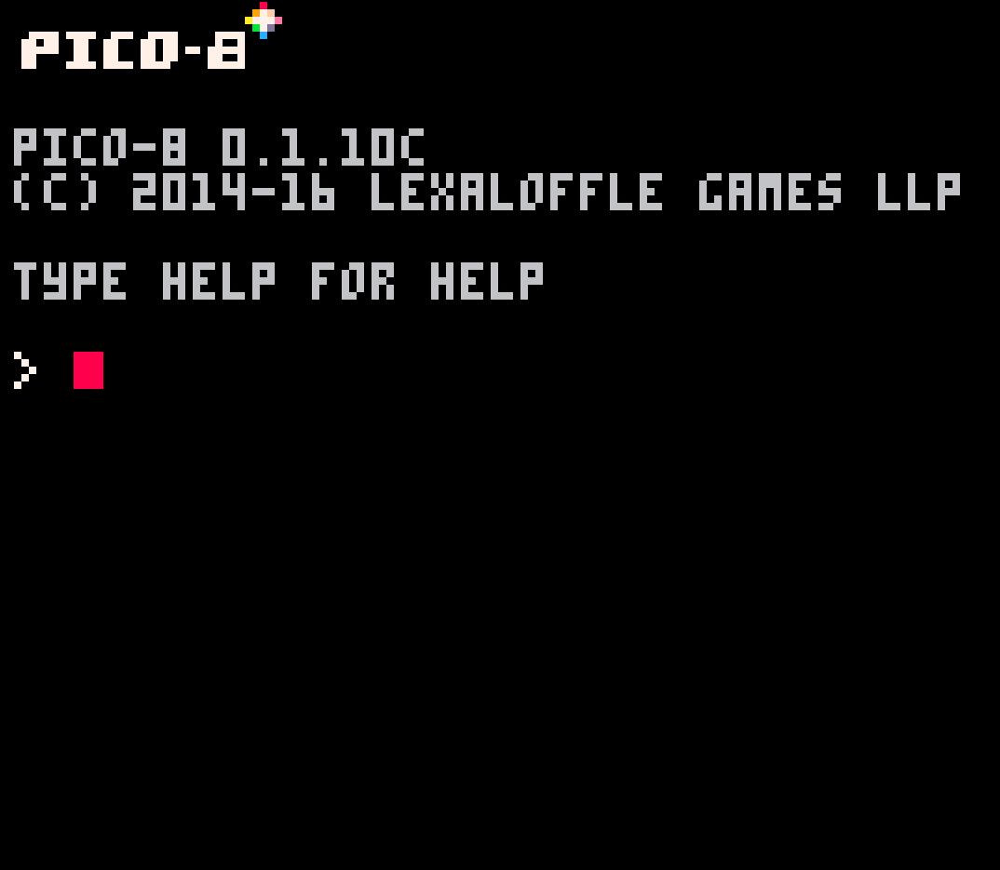
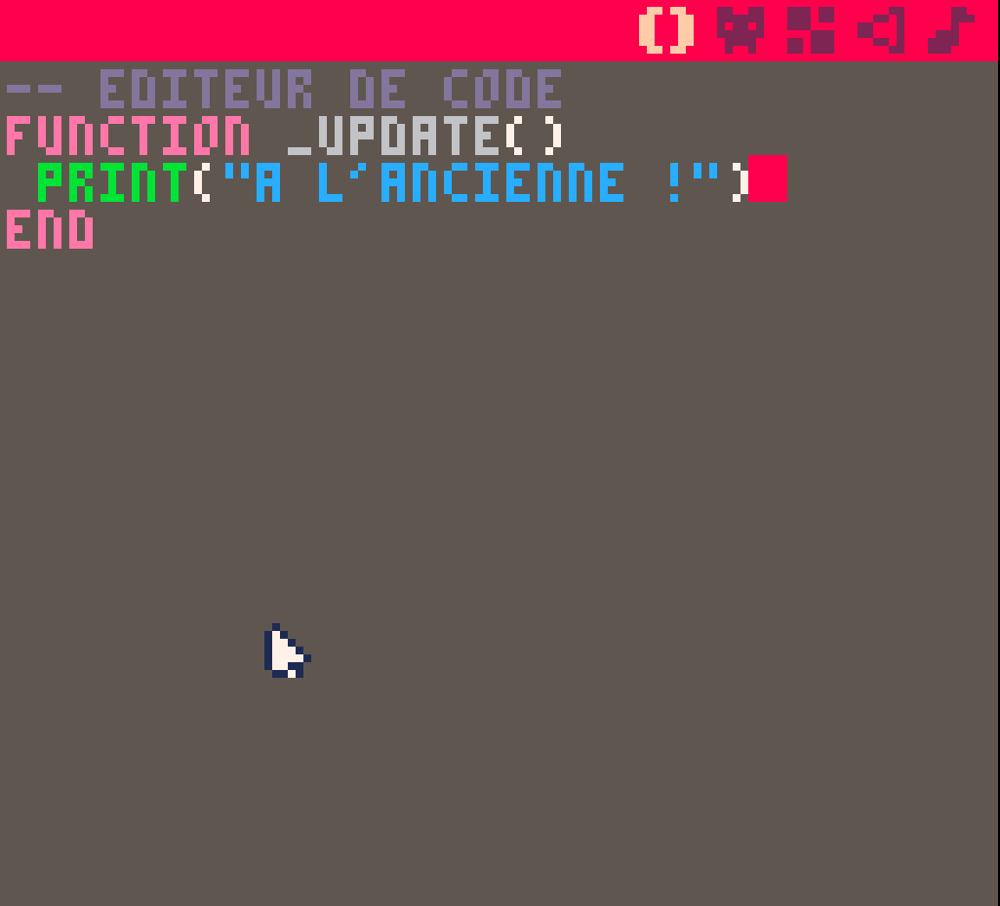

## C'est quoi ?

Une "fantasy console". Une console virtuelle qui fait tourner des vrais jeux et intègre tout ce qu'il faut pour les créer, modifier et exécuter.

- Le site officiel : [https://www.lexaloffle.com/pico-8.php](https://www.lexaloffle.com/pico-8.php)
- Une licence pour chez vous = 15$ (~13€)
- Installé sur les postes de l'UCO mais licence **éducation** à ne pas ramener chez vous

## Pourquoi ? C'est tout petit, tout moche, tout...

Chut. C'est en fait, très bien.
Les contraintes techniques et l'environnement très limité permettent de se concentrer sur l'essentiel.

1. Apprendre la programmation

PICO-8 exécute des scripts en **Lua**, [un langage de script brésilien](https://www.lua.org) simple, souple, puissant et très utilisé par les Game et Level Designers pour scripter des jeux.
Le Lua ne s'embarasse pas trop de contraintes techniques et est parfait pour apprendre les bases.

2. L'environnement

Vous ne pouvez rien casser. Rien. Au pire le jeu plante, on s'en fiche.
Par contre très vite vous allez afficher des sprites, des effets sympas, faire bouger des choses à l'écran. En quelques lignes de code seulement.

## Ressources

PICO-8 est assez populaire chez les gamedevs. Pour qui sait fouiller un peu, c'est même une mine d'or sur le sujet.
Quelques liens bien utiles :

- [PICO-8 cheat sheet](https://neko250.github.io/pico8-api/)
- [PICO-8 awesome resources](https://github.com/felipebueno/awesome-PICO-8)
- [PICO-8 tutorial video series](https://www.youtube.com/watch?v=ZuaLuMhwcc8)

## Démarrage

Lancer l'exécutable PICO-8. ESC permet de passer du `prompt` (là où on tape des commandes) à l'éditeur et vice-versa

Quelques commandes :

|Commande|Effet|
|---|---|
| `HELP`| Taper pour avoir la liste des commandes |
| `DIR`| liste les fichiers du dossier courant |
| `CD` | permet de changer de dossier |
| `LOAD`| permet de charger un fichier |
| `RUN`| permet de lancer le jeu chargé |
| `CLS`| nettoie l'écran |

## GIF

PICO-8 permet d'enregistrer et d'exporter des GIF super simplement.

1. Appuyez sur `F8` pour indiquer le début du GIF
2. Appuyez sur `F4` pour terminer le GIF
3. Admirez votre oeuvre sur le bureau
