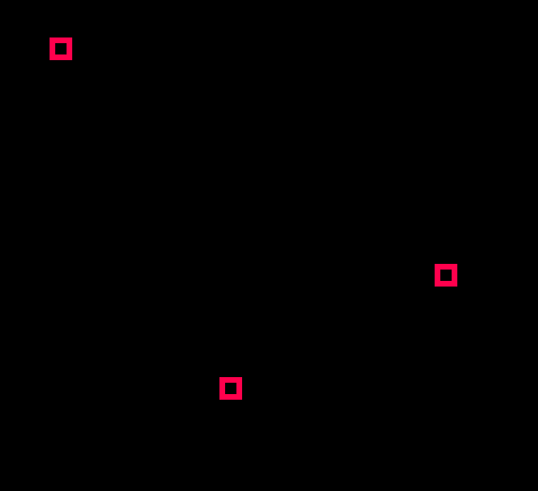

Avec les variables, nous avons vu comment stocker **une valeur** dans **une variable**.

Il existe un mécanisme pour stocker **plusieurs** valeurs dans **une seule** variable : les **tableaux** (`Table` en Lua).

*Note : en Lua, les tableaux sont plus proches des listes C# mais le principe reste le même*

## Création d'un tableau

Attention les yeux, c'est très compliqué !

```lua
array={}
```

## Utilisation

Vérifions :

```lua
PRINT(array) -- TABLE
```

On peut ajouter des valeurs :

```lua
add(array,42)
add(array,24)
add(array,89)
add(array,32)

PRINT(#array) -- Affiche la taille du tableau, ici 4
```

Et on peut lire les valeurs en indiquant la position de l'élément voulu entre crochets `[]`

```lua
PRINT(array[1]) -- 42
PRINT(array[2]) -- 24
PRINT(array[3]) -- 89
PRINT(array[4]) -- 32
```

*Note : Lua est un des seuls langages à faire commencer les tableaux à __1__ !*

L'intérêt ? Appliquer le même code à tous les éléments du tableau.

```lua
FOR i=1,#array DO -- i commence à 1 !
  PRINT(array[i])
END
```

## Exercice

### Correction

## table = struct

Nous venons de voir les principes de programmation sur les tableaux qui se retrouvent dans la plupart des langages.

En lua, les `table` sont plus puissantes que des simples tableaux. Elles servent aussi à créer, stocker et organiser les données. Ce sont les **structutres** (`struct`) de données !

Mais qu'est-ce que ça veut dire ?!
Cela veut dire que nous pouvons par exemple stocker dans **une seule** `table` toutes les données du joueur :

```lua
player={}
player['x'] = 32
player['y'] = 32
player['wpn'] = 0
```

Ici nous retrouvons les `[]` caractéristiques des tableaux sauf que nous y accédons avec une chaîne de caractère au lieu d'un nombre.

Encore mieux et plus lisible, on peut remplacer l'accès avec des crochets pour une **notation pointée** :

```lua
player={}
player.x = 32
player.y = 32
player.wpn = 0
```

Nous voyons ici une syntaxe et un usage très différent de ce que nous avons vu précédemment, mais les deux peuvent se combiner.
Par exemple... pour une liste d'ennemis !

```lua
enemies={}
enemies[1]={}
enemies[1].x = 32
enemies[1].y = 10
enemies[2]={}
enemies[2].x = 100
enemies[2].y = 50
enemies[3]={}
enemies[3].x = 62
enemies[3].y = 70
```

Ici nous stockons 3 ennemis, chaque ennemi est un couple de coordonnées `x` et `y`. Du coup, c'est facile à utiliser par la suite.

*Note : il faut toujours créer la table avec `{}` avant de l'utiliser*.

On peut écrire cela plus simplement :

```lua
enemies={}
enemies[1]={x = 32, y = 10}
enemies[2]={x = 100, y = 50}
enemies[3]={ x = 62, y = 70}
```

Ces tables peuvent être parcourus comme précédemment. Exemple pour afficher chaque ennemi :

```lua
FUNCTION _DRAW()
	CLS()
	FOR i=1,#enemies DO
		-- affiche un carre
		RECT(enemies[i].x, enemies[i].y, enemies[i].x+3, enemies[i].y+3, 8)
	END
END
```



L'intérêt ? On affiche avec une seule ligne de code 0, 1, 2 ou plusieurs ennemis !
