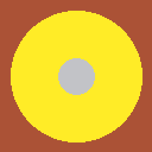

# Amusons-nous avec PICO-8

Moins de théorie, plus de pratique ! Voici des exercices divers et variés.

## Exercice : tunnel épileptique

Premier effet visuel facile et inutile :



1. Dessiner un cercle avec `circfill(x,y,rayon,color)`
2. Le rayon du cercle doit devenir une variable `r`. Augmenter cette variable à chaque frame dans `_UPDATE()` et dessinez le cercle dans `_DRAW()`
3. Au lieu d'avoir un seul rayon, créons un tableau de rayons de cercle. Chaque rayon doit être augmenter et dessiner à chaque frame.
Ajouter 3-4 rayons (et donc cercle) pour tester.
4. Créez automatiquement des cercles régulièrement (par exemple toutes les 30 frames). On peut obtenir une couleur aléatoire avec `flr(rnd(15))`
5. Supprimez automatiquement des cercles (par exemple quand le rayon d'un cercle est > 100 ou quand on a plus de 5 crecles à l'écran)

### Correction

```lua
circles={}

function addcircle()
	add(circles, {
		r=1,
		col=flr(rnd(15))
	})
end

function _init()
	addcircle()
end

function _update()
	for c in all(circles) do
		c.r=c.r+1
		if c.r==42 then
			addcircle()
		end
	end

	if #circles>4 then
		del(circles, circles[1])
	end
end

function _draw()
	cls()
	for c in all(circles) do
		circfill(64,64,c.r,c.col)
	end
end
```

## Exercice : exploser un hamburger

A un moment quelqu'un me dira que j'ai un problème avec la bouffe.

En attendant, un effet visuel sympa :


1. Dessiner un hamburger à l'écran. Pour cela, on va stocker dans une variable la position `x`,`y` et la couleur de chaque pixel du hamburger.
2. On utilisera ensuite une boucle `for` dans `_DRAW()` pour afficher en une seule ligne chaque pixel du hamburger.
3. Ajouter un booléen `exploding` qui commence à `false`
4. Ajouter la détection de l'appui sur un bouton (X ou C - 5 ou 4) pour passer le booléen à `true`
5. Ajouter dans la fonction `_UPDATE()` :
  1. Seulement si `exploding` est vrai
  2. Parcourir tous les pixels
  3. Leur ajouter en x et en y un nombre aléatoire (`RND(1)`)

On a un mouvement de destructuration un peu moche, mais c'est un début !

Pour faire mieux, il va falloir ajouter de la gravité. Vous avez peur ? C'est en fait tout simple : en plus de la position x, y et de la couleur on va ajouter la vélocité en x et y.
La vélocité, c'est la valeur que l'on va ajouter à chaque frame à la position. Si la vélocité augmente ou diminue, le pixel va accélérer ou ralentir !

Exemple pour un pixel `p`. On nommera `dx` et `dy` la vélocité en x et y en hommage aux cours de physique.

```lua
-- Impulsion initiale
p.dx=1
p.dy=-3

-- A chaque frame, faire
p.x=p.x+p.dx
p.y=p.y+p.dy

-- Pour la gravité, modifier dy :
p.dy=p.dy+1
```

6. Ajouter la vélocité à chaque pixel
7. Affiner : ajouter du random en x et y au bon moment pour donner un effet sympa

### Correction

```lua
hamburger={
  -- buns
  {x=63,y=64,c=9},
  {x=64,y=64,c=9},
  {x=65,y=64,c=9},
  {x=66,y=64,c=9},
  {x=67,y=64,c=9},
  {x=63,y=60,c=9},
  {x=64,y=60,c=9},
  {x=65,y=60,c=9},
  {x=66,y=60,c=9},
  {x=67,y=60,c=9},
  {x=63,y=59,c=9},
  {x=64,y=59,c=9},
  {x=65,y=59,c=9},
  {x=66,y=59,c=9},
  {x=67,y=59,c=9},
  -- steack
  {x=63,y=62,c=4},
  {x=64,y=62,c=4},
  {x=65,y=62,c=4},
  {x=66,y=62,c=4},
  {x=67,y=62,c=4},
  {x=63,y=63,c=4},
  {x=64,y=63,c=4},
  {x=65,y=63,c=4},
  {x=66,y=63,c=4},
  {x=67,y=63,c=4},
  -- salad & cheese
  {x=63,y=61,c=11},
  {x=64,y=61,c=11},
  {x=65,y=61,c=10},
  {x=66,y=61,c=10},
  {x=67,y=61,c=11},
}

boom=false

function _update()
	-- press x to destroy hamburger
	if(btn(5)) then
		boom=true

		-- initial velocity for all pixels
		for p in all(hamburger) do
			p.dx=rnd(1)-rnd(1)
			p.dy=-3
		end
	end

	if boom then
		-- move all pixels
		for p in all(hamburger) do

			-- add velocity		
			p.x=p.x+p.dx
			p.y=p.y+p.dy

			-- gravity
			p.dy=p.dy+rnd(1)

		end
	end
end

function _draw()
	cls()
	-- draw all pixels
	for p=1,#hamburger do
		pset(hamburger[p].x,hamburger[p].y,hamburger[p].c)
	end
end
```

# TODO

Idées

Scroling
Collisions

Map

Shooter
